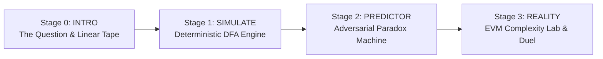
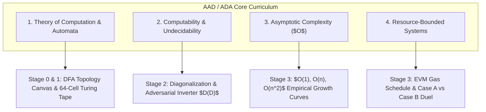

# HALT // ? — The Halting Problem & EVM Gas Model

[](https://react.dev/)
[](https://www.typescriptlang.org/)
[](https://vitejs.dev/)
[](https://tailwindcss.com/)
[-mint?style=flat-square&color=4EBA86)](https://en.wikipedia.org/wiki/Analysis_of_algorithms)
[](LICENSE)

> ### 🎓 Academic Course Submission
> - **Subject / Course**: Analysis and Design of Algorithms (AAD / ADA)
> - **Project Domain**: Computability Theory, Automata, and Resource-Bounded Execution
> - **Central Problem**: Turing's Halting Problem ($H(P, i)$) & Its Practical Resolution in the Ethereum Virtual Machine (EVM)
> - **Submission Deliverable**: Interactive Desktop-First Computational Laboratory & Scientific Simulation

---

## Table of Contents

1. [Course & Subject Submission Profile](#course--subject-submission-profile)
2. [Academic Overview](#academic-overview)
3. [Core Product Thesis](#core-product-thesis)
4. [Architecture & Stages](#architecture--stages)
   - [Stage 0: Prologue // The Undecidable Question](#stage-0-prologue--the-undecidable-question)
   - [Stage 1: Simulation // Deterministic Machine](#stage-1-simulation--deterministic-machine)
   - [Stage 2: Paradox // The Adversarial Inverter](#stage-2-paradox--the-adversarial-inverter)
   - [Stage 3: Reality // EVM Complexity Laboratory](#stage-3-reality--evm-complexity-laboratory)
5. [Theoretical Concepts Demonstrated](#theoretical-concepts-demonstrated)
   - [State Transition Topology (DFA)](#state-transition-topology-dfa)
   - [Turing's Diagonalization Proof](#turings-diagonalization-proof)
   - [The EVM Gas Model & The Halting Illusion](#the-evm-gas-model--the-halting-illusion)
6. [Curriculum & Pedagogical Mapping](#curriculum--pedagogical-mapping)
7. [Audio Synthesizer Engine](#audio-synthesizer-engine)
8. [Tech Stack](#tech-stack)
9. [Getting Started](#getting-started)
   - [Prerequisites](#prerequisites)
   - [Installation](#installation)
   - [Development](#development)
   - [Production Build](#production-build)
10. [Project Structure](#project-structure)
11. [License](#license)

---

## Course & Subject Submission Profile

| Attribute | Details |
| :--- | :--- |
| **Course Name** | **Analysis and Design of Algorithms (AAD / ADA)** |
| **Project Title** | **HALT // ? — The Halting Problem in Ethereum Smart Contracts** |
| **Core Problem** | Mathematical Undecidability, The Halting Problem, Adversarial Inversion, and Concrete Gas Metering |
| **Primary Syllabus Modules** | • Computability & Undecidability (Turing Machines & Reductions)<br/>• Automata & State Transition Graphs (DFA / NFA)<br/>• Asymptotic Time & Space Complexity ($O(1), O(n), O(n^2)$)<br/>• Resource-Bounded Computation Models |
| **Deliverable Format** | Interactive Web Laboratory, Simulation Engine, and Visual Demonstration |

---

## Academic Overview

In 1936, Alan Turing solved David Hilbert's *Entscheidungsproblem* by proving that **no universal algorithm can determine whether an arbitrary computer program will finish running or run forever**.

In 2015, Ethereum introduced the **Ethereum Virtual Machine (EVM)**—a decentralized, Turing-complete computer replicated across thousands of validator nodes worldwide. Because the EVM is Turing-complete, it inherited Turing's 80-year-old curse: **a malicious or buggy smart contract with an infinite loop could halt the entire global blockchain network**.

Because static analysis cannot universally predict termination, Ethereum implemented an economic halting mechanism: **Metered Gas**.

**`HALT // ?`** allows students, engineers, and researchers to experience this connection through live state simulation, paradox construction, and empirical EVM gas measurement.

---

## Core Product Thesis

> *"Do not tell the user what the Halting Problem is. Let them try to predict a program, then let the system demonstrate why a universal predictor is mathematically impossible."*

---

## Architecture & Stages



### Stage 0: Prologue // The Undecidable Question
- **Conceptual Grounding**: Introduces the foundational paradox of computation.
- **State Transition Topology Preview**: Interactive directed graph illustrating state nodes ($q_0 \to q_{eval} \to q_{halt} / q_{loop}$).
- **Linear Tape Viewport**: A live 64-cell paper memory tape with a real-time tracking read/write head, directly honoring Turing's original 1936 mechanical model.

### Stage 1: Simulation // Deterministic Machine
- **Interactive DFA State Graph**: Real-time visualization of machine execution with active execution heads, animated transition edges, and register snapshots.
- **3 Selectable Routines**:
  - `Finite Counter`: A deterministic loop ($i < 5$) that terminates safely into $q_{halt}$.
  - `Unbounded Infinite Loop`: A loop without an exit condition, trapped in $q_{spin} \to q_{recurse} \to q_{spin}$ ($\infty$).
  - `Parameterized Loop`: Dynamic loop bound ($i < N$) controlled via a smooth scroll line and mouse wheel ($N \in [1, 50]$).
- **Execution Trace Tape**: Granular ledger of instruction steps, register mutations, and pointers.
- **Academic Checkpoint Safety Rails**: Automatic audio warnings at step 60 and modal interrupts at step 67 ($67 \to 134 \to 201$), visually demonstrating why empirical execution cannot prove non-termination.

### Stage 2: Paradox // The Adversarial Inverter
- **Interactive Paradox Construction**: Step-by-step interactive proof of Turing's Diagonalization argument.
- **Hypothetical Machine $H$**: The user constructs a universal analyzer that claims to predict whether any program $P$ halts on input $i$:
  $$\mathcal{H}(P, i) \in \{\text{HALT}, \text{LOOP}\}$$
- **The Diabolical Inversion Machine $D$**: Constructing program $D$ which queries $\mathcal{H}(D, D)$ and does the exact opposite:
  $$\mathcal{D}(P) = \begin{cases} \text{LOOP } (\infty) & \text{if } \mathcal{H}(P, P) = \text{HALT} \\ \text{HALT} & \text{if } \mathcal{H}(P, P) = \text{LOOP} \end{cases}$$
- **Interactive Contradiction**: Feeding $D$ into itself ($\mathcal{D}(D)$) produces an inescapable logical deadlock, proving that no universal predictor $\mathcal{H}$ can exist.

### Stage 3: Reality // EVM Complexity Laboratory
- **EVM Resource Synthesis**: How modern distributed systems handle undecidability via deterministic resource metering.
- **Complexity Class Explorer**:
  - $O(1)$ Constant opcode overhead ($\sim 1,421\text{ gas}$)
  - $O(n)$ Linear loop expansion ($\sim 190\text{ gas/op}$)
  - $O(n^2)$ Quadratic polynomial state bloat ($\sim 194\text{ gas/n}^2$)
- **Dynamic 30-Segment Fuel Cell**: A hardware-styled LED rail simulating transaction gas depletion in real time.
- **Interactive EVM Stepper (`RUN TX` & `STEP`)**:
  - Real-time opcode trace stream (`PUSH1`, `MSTORE`, `SLOAD`, `JUMPI`, `GAS`, etc.).
  - Deterministic state outcomes: `STATUS 1 (SUCCESS)` with gas refunds vs. `STATUS 0 (REVERTED: OUT_OF_GAS)`.
- **Empirical SVG Benchmark Canvas**: Real measured Ethereum gas costs vs. theoretical models, featuring autoscaling, block ceiling overlays ($10\text{M gas}$), and interactive benchmark chips.
- **Case A vs Case B Duel Simulator**:
  - **Case A**: Finite but computationally expensive loop ($N = 800$, terminates naturally at $128,450\text{ gas}$).
  - **Case B**: Infinite malicious cycle (`while(true)`, never halts).
  - Side-by-side execution under identical gas budgets ($100,000\text{ gas}$ vs $600,000\text{ gas}$) demonstrating **The Halting Illusion**: both transactions revert with identical out-of-gas errors, proving that gas bounds execution without solving undecidability.

---

## Theoretical Concepts Demonstrated

### State Transition Topology (DFA)

In formal language theory, an execution routine is represented as a 5-tuple:
$$M = (Q, \Sigma, \delta, q_0, F)$$

Where:
- $Q = \{q_0, q_1, q_{eval}, q_{inc}, q_{halt}, q_{loop}\}$ (Machine States)
- $\Sigma = \{0, 1, \dots, N\}$ (Register Alphabet)
- $\delta: Q \times \Sigma \to Q \times \Sigma$ (State Transition Function)
- $q_0$ (Start State)
- $F = \{q_{halt}\}$ (Terminal Accepting States)

### Turing's Diagonalization Proof

The paradox machine demonstrates that the set of halting programs is **undecidable** (recursively enumerable but not recursive):
$$\mathcal{K} = \{ \langle M, w \rangle \mid M \text{ halts on input } w \} \notin \mathbf{R}$$

### The EVM Gas Model & The Halting Illusion

Ethereum transactions specify a **Gas Limit** ($G_L$) and **Gas Price** ($G_P$). Every EVM opcode consumes a fixed amount of gas defined in the Ethereum Yellow Paper:

$$\text{Gas}_{\text{spent}} = G_{\text{base}} + \sum_{k=1}^{m} \text{Cost}(\text{op}_k)$$

When $\text{Gas}_{\text{spent}} > G_L$:
1. The EVM halts execution immediately.
2. State modifications are reverted.
3. Consumed gas is forfeit to the validator (preventing DoS attacks).

**The Halting Illusion**: A gas limit converts an undecidable question into a decidable bounded execution, but it **does not distinguish** between an infinite loop and a finite algorithm whose budget was set too low.

---

## Curriculum & Pedagogical Mapping

This project was built specifically for submission in **Algorithm Analysis and Design (AAD / ADA)**, directly covering four fundamental pillars of the syllabus:



| Syllabus Topic | Formal Concept | How the Application Demonstrates It |
| :--- | :--- | :--- |
| **Automata & Machine Models** | Deterministic Finite Automata (DFA), Turing Tapes | **Stage 0 & 1**: Live state transition graph with nodes ($q_0 \to q_{eval} \to q_{halt}/q_{loop}$) and a discrete 64-cell paper memory tape. |
| **Computability & Intractability** | The Halting Problem, Decision Problems, Reduction | **Stage 2**: Constructing a hypothetical decider $H(P, i)$, exposing why no static analyzer can solve the decision problem for all inputs. |
| **Proof Techniques** | Proof by Contradiction, Cantor's Diagonalization | **Stage 2**: The user constructs the adversarial machine $D$ that inverts $H$'s output, creating the direct contradiction $D(D)$. |
| **Asymptotic Complexity** | Big-O Notation: $O(1)$, $O(n)$, $O(n^2)$ | **Stage 3**: Real-time opcode calculation comparing fixed overhead, linear step cost, and quadratic state growth. |
| **Resource-Bounded Execution** | Time Complexity vs. Concrete Gas Budgets | **Stage 3**: Yellow Paper EVM gas metering, 30-segment hardware LED rail, and the "Halting Illusion" duel. |

---

## Audio Synthesizer Engine

The application includes a zero-dependency Web Audio API sound engine (`src/utils/audio.ts`) providing real-time acoustic feedback:

- **Step Tick**: Pure sine pulse at $800\text{ Hz}$ ($30\text{ms}$) for step progression.
- **Halt Chime**: Harmonious major triad ($523.25\text{ Hz} \to 659.25\text{ Hz} \to 783.99\text{ Hz}$) on normal termination.
- **Warning Tone**: Sawtooth buzz at $180\text{ Hz}$ ($180\text{ms}$) on checkpoint safety pauses and gas breaches.
- **Paradox Deadlock**: Dual square wave dissonance ($140\text{ Hz} + 148\text{ Hz}$) on adversarial contradiction.
- Audio can be globally toggled from the persistent navigation header.

---

## Tech Stack

| Technology | Purpose |
| :--- | :--- |
| **React 19** | Component hierarchy, concurrent state management, and UI reactivity |
| **TypeScript 6** | Strict type safety, engine interfaces, and opcode definitions |
| **Vite 8** | High-performance build tool, ESM bundling, and ultra-fast HMR |
| **Tailwind CSS 3.4** | Design system, responsive layouts, glassmorphism, and color palette |
| **Lucide React** | Clean, scientific iconography |
| **Web Audio API** | Synthetic sound effects for state transitions and feedback |
| **Oxlint** | High-speed JavaScript/TypeScript linter |

---

## Getting Started

### Prerequisites

- **Node.js**: v18.0.0 or higher
- **npm** (or `pnpm` / `yarn`)

### Installation

Clone the repository and install dependencies:

```bash
git clone https://github.com/your-username/aad-2-0.git
cd aad-2-0
npm install
```

### Development

Run the local Vite development server:

```bash
npm run dev
```

Open [http://localhost:5173](http://localhost:5173) in your browser.

### Production Build

Compile TypeScript and build the optimized production bundle:

```bash
npm run build
```

Preview the production build locally:

```bash
npm run preview
```

---

## Project Structure

```
aad-2.0/
├── public/                 # Static assets and icons
├── src/
│   ├── components/
│   │   ├── layout/         # Persistent Header & Sidebar Navigation
│   │   │   ├── Header.tsx
│   │   │   └── Sidebar.tsx
│   │   └── stages/         # The 4 Interactive Pedagogical Bays
│   │       ├── Stage00Intro.tsx       # Prologue & Topology Preview
│   │       ├── Stage01Simulator.tsx   # Turing DFA Simulator & Checkpoints
│   │       ├── Stage02Predictor.tsx   # Paradox & Inversion Machine
│   │       └── Stage03Reality.tsx     # EVM Complexity Lab & Duel Simulator
│   ├── data/
│   │   └── gasData.ts      # Empirical EVM opcode benchmark tables & data
│   ├── engine/
│   │   ├── interpreter.ts  # Deterministic Turing Machine execution engine
│   │   ├── predictor.ts    # Halting predictor evaluation logic
│   │   ├── programs.ts     # Pre-configured programs & routines
│   │   └── types.ts        # Core TypeScript interfaces & domain models
│   ├── utils/
│   │   └── audio.ts        # Zero-dependency Web Audio API synthesizer
│   ├── App.tsx             # Root Application Shell & Stage Routing
│   ├── index.css           # Global Tailwind CSS directives & color tokens
│   └── main.tsx            # React application entry point
├── package.json            # Scripts & project dependencies
├── tailwind.config.js      # Custom theme tokens (canvas, mint, surface, etc.)
├── tsconfig.json           # TypeScript configuration
└── vite.config.ts          # Vite build pipeline configuration
```

---

## License

This project is open-source software licensed under the [MIT License](LICENSE).
